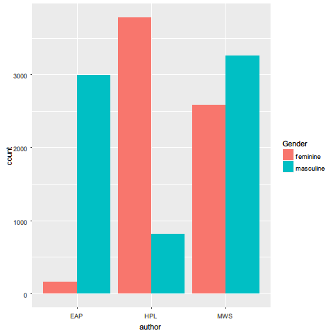

# Spring2018
----
# Project 1: An R Notebook Data Story on Horror Stories

----


### [Project Description](doc/)
This is the first and only *individual* (as opposed to *team*) this semester. 

Term: Spring 2018

+ Project title: An R Notebook Data Story on Horror Stories
+ This project is conducted by Jiongjiong Li, Columbia UNI: jl5020
+ Project summary: The project is to study the spooky text data using tools from text mining and natural language processing such as sentiment analysis, topic modelling, to characterize the writing styles of the three authors.

Following [suggestions](http://nicercode.github.io/blog/2013-04-05-projects/) by [RICH FITZJOHN](http://nicercode.github.io/about/#Team) (@richfitz). This folder is organized as follows.

```
proj/
├── lib/
├── data/
├── doc/
├── figs/
└── output/
```

Please see each subfolder for a README file.

----
## **What can the words and sentences tell us？**
### **Word Cloud**
First we generate several word clouds to get a brief idea of the spooky data.
#### Whole spooky data


We can see from the above graph that frequent words in spooky data are "love", "dark" and "human".
#### EAP word cloud


#### HPL word cloud


#### MWS word cloud


We can see that different authors have different preferences for using words. For Edgar Allan Poe, he most frequently use words like "mind" and "manner".  HP Lovecraft likes to use words "strange" and "horror". While for Mary Shelley, her most frequent words are "love" and "death".These frequent words are pretty normal for the horror authors.
### **Numerical summaries of the data**
Second, we do some some numerical summaries of the data to provide us with some visualizations. In this way, we can have a deeper understanding of the writing styles of different authors.


So in the spooky data, Edgar Allan Poe has the most sentences and HP Lovecraft has the least. As for the average sentence length, HP Lovecraft writes the longgest sentence while Edgar Allan Poe writes the shortest sentence. When it comes to the average word length, we can see that Edgar Allan Poe uses the longgest word and there is no clear difference in word length between HP Lovecraft and Mary Shelley.
### **He/She difference**
We take a look at the difference of using he/she between different authors.



Both Edgar Allan Poe and HP Lovecraft have very clear preference in using masculine third-person words or feminine third-person words. Edgar Allan Poe uses the masculine third-person words more often (he,him,his) while HP Lovecraft uses the feminine third-person words (she,her) more often. Mary Shelley uses masculine third-person words and feminine third-person words almost equally (A bit more in masculine).
### **TF-IDF values**
We try to find words that are characteristic for a specific author by using tf-idf as a heuristic index to indicate how frequently a certain author uses a word.


The above graph shows the thirty tf_idf scores in all the words and we see that words from Mary Shelley have the highest TF-IDF values. Besides, most of the words in the top 30 are actually names. Names work quite well in identifying authors as there is little possibilty that different authors will use the same name for their characters.

### **TF-IDF values after stem**

We use the "wordstem" function to extract the stems of each of the given words and then compute the TF-IDF values of words again to find if the results changes or not.


Note that the graph result actually don't change. Maybe it's because the high TF-IDF value words are names. The stems of names are the same as names. 
## **Sentiment Analysis of different authors**
### **Negative/Positive**
In this sentiment analysis part, we do the sentiment analysis on the word level.
We first use the **"nrc"** lexicon and measure the negetive and positive portion of total sentiment.


Overall we can see that in different authors' text, the negative sentiment accounts more than the positive sentiment. In Edgar Allan Poe's article, he has more positive parts.
To prove that our result is robust, we choose one different lexicon **"bing"**.


Using the "bing" lexicon, the result actually doesn't change. In text,the negative sentiment is more than the positive sentiment. Besides, we can see that now the neagtive sentiment is accounting for more part than before. Besides, now in Edgar Allan Poe's article, he has more negative parts.
### **Top emptions by different authors**
Since in the Negative/Positive part, the result of using different lexicons is not that different, so we still use the **"nrc"** lexicon to find the top emotions of different authors.


We can see that the top emotions are pretty different among these authors. For Edgar Allan Poe, his top emotions are "trust, fear and anticipation". HP Lovecraft's top emotions are "fear, sadness and trust". Mary Shelley's top emotions are "fear, trust and sadness".
## **Topic Modelling**
In this part we will do the topic modelling of different authors. We choose 6 topics and the visualization of the author topics are:
### **Edgar Allan Poe topic**


### **HP Lovecraft topic**


### **Mary Shelley topic**


In the above, we see that for Edgar Allan Poe, the first topic is characterized by words like "doubt", "time", and the third topic includes the word "death", and the fifth topic the word "individual". For HP Lovecraft,  the first topic is characterized by words like "strange", "house", and the third topic includes the word "death", and the sixth topic the word "time","life. For Mary Shelley, she first topic is characterized by words like "heart", "love", and the third topic includes the word "time" and "life", and the fifth topic the word "hand". Note that the words "eyes", "time" and "life" appear in many topics.  